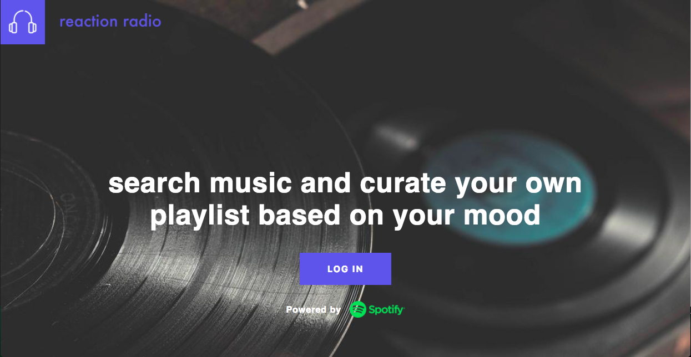
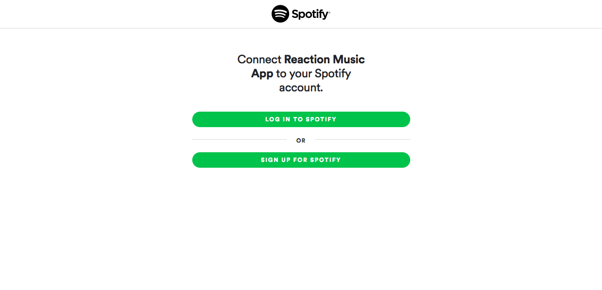
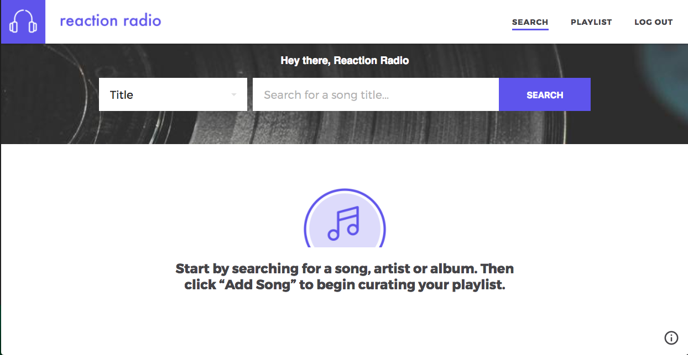
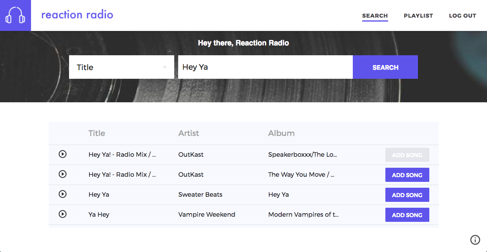
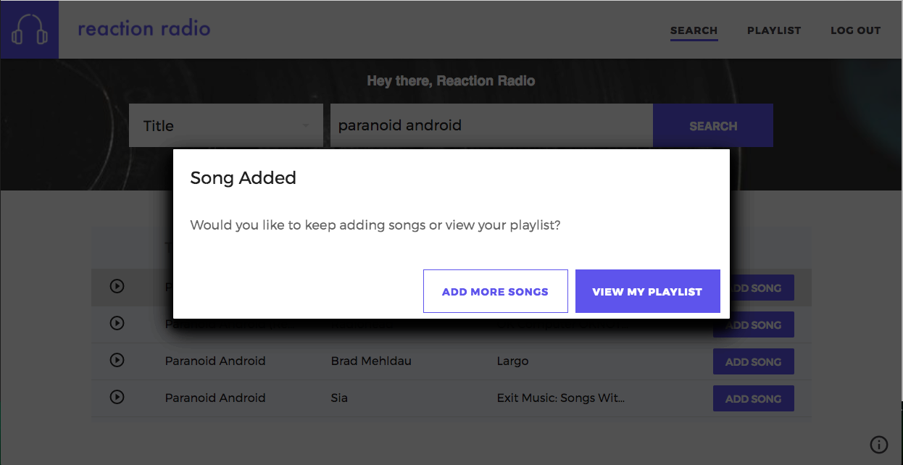
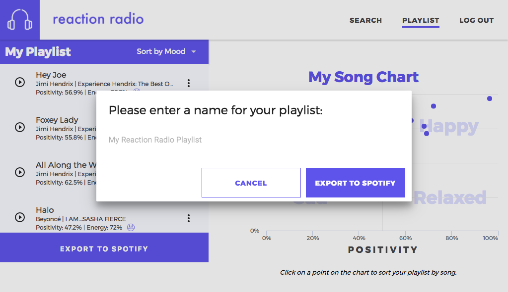
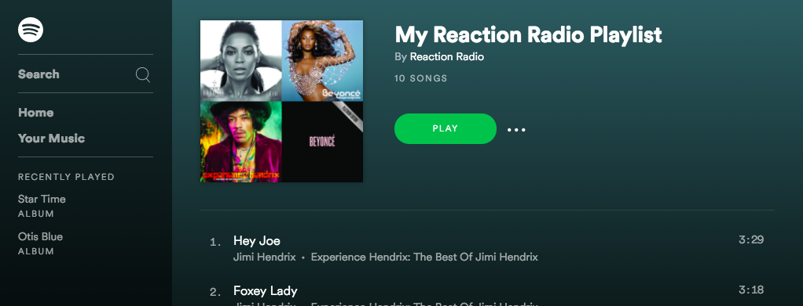
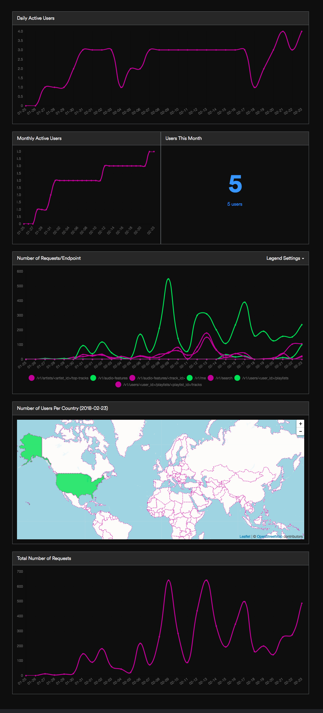
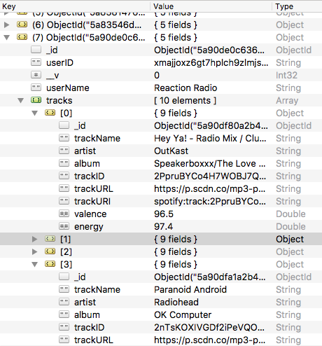

# Reaction Music App 🎵🙂😢😡😌🎵

Create Spotify playlists that can be sorted by mood.

## Description

[Spotify’s API](https://developer.spotify.com/web-api/) provides a multitude of information about their library of songs, including measures of audio features, such as song valence (or as we like to call it, "positivity") and song energy. These features can correlate with mood. A song high on the valence and energy scales is going to be happy! 

Reaction Music App allows you create a playlist of songs, see how they fall on a mood chart, and then lets you edit and sort by mood. Once you have a playlist that you are satisfied with, you can easily export it to your Spotify account.

## Getting Started

### Live Example

[https://reaction-music.herokuapp.com/](https://reaction-music.herokuapp.com/)

> Since the app is hosted on a free [Heroku](https://www.heroku.com/) instance, it may need some time to boot up.

### Installing

After downloading the distribution, you will need to download the app dependencies:

```
$ cd reaction
$ yarn install
$ cd client
$ yarn install
```

Then, navigate to the root directory and run the application:

```
$ cd reaction
$ yarn start
```

## Using Reaction Radio

1. To start using Reaction Radio, sign in to Spotify using our log in button.

	
	
	
	
2. Once you have signed in, you may begin to add songs to your Reaction Radio playlist! Search by either song title, artist, or album. When you find a song that you want to add, click ```Add Song```.

	
	
	
	
3. After adding songs that you like, click ```View My Playlist``` to begin exploring your playlist.

	
	
4. On your Playlist page, you may sort tracks by mood, or sort by specific track. Create the playlist you want to hear. See any songs that don't match the mood you're feeling? Delete them!
 
	

5. Once you're happy with your Reaction Radio playlist, go ahead and hit that Export button. Your playlist will be added to your Spotify account.




## Insights
As a developer, Spotify provides a ton of useful analytical information about your app:

* Daily Active Users
* Monthly Active Users
* How users are using your app 
* Where your users are located in the world

As our app grows and we add more features, we can see which features are being utilized by our users, so we can develop and improve them even more.



Our database collects information about the songs that our users are searching through our app (no emails or real names are collected). With enough information, we can do some interesting analytics of our own:

* Most searched for songs
* Happiest songs
* Saddest songs
* Angriest songs
* Chillest songs
* Average mood of specific artists and/or albums



## Deployment
You can easily deploy this application to a platform such as Heroku.

1. Register an application on [Spotify Developer](https://developer.spotify.com/). Once registered, you must add the following Redirect URIs to your application (found in the application settings in [My Apps](https://beta.developer.spotify.com/dashboard/applications)).

	Local Direct:
	> localhost:3000/home
	
	Your Remote Redirect:
	> [YOUR APP URL]/home

2. When you are ready to deploy, navigate to ```reaction/client/src/pages/LoginPage/LoginPage.js```. 

	Comment out the local ```REDIRECT_URL``` and use the Heroku ```REDIRECT_URI``` instead. Replace the remote URI with the URI of your application. (It must end in ```/home```).
  
	```
	IF USING LOCALHOST, USE THIS URL
	const REDIRECT_URI = encodeURIComponent('http://localhost:3000/home');
	
	// IF USING HEORKU, USE THIS URL
	// const REDIRECT_URI = encodeURIComponent('https://reaction-music.herokuapp.com/home/');
	```
3. Run ```yarn build``` and deploy!

## Built With

* [React](https://reactjs.org/) - JavaScript library for building user interfaces
* [Material UI](http://www.material-ui.com/) - Google's material design UI components built with React.
* [Highcharts](https://www.highcharts.com/) - JavaScript charting library
* [Node.js](https://nodejs.org/) - A JavaScript run-time environment
* [Express](https://expressjs.com/) - A Node.js web application framework
* [MongoDB](https://www.mongodb.com/) - A NoSQL database program
* [Spotify Web API](https://developer.spotify.com/web-api/) - Spotify Web API for retrieving song data
* [React Flip Move](https://github.com/joshwcomeau/react-flip-move) - Animation for React list components 

## Authors

* **Victoria Palacios**
	* [GitHub](https://github.com/victoriapalacios)
	* [LinkedIn](https://www.linkedin.com/in/victoriapalacios/)

* **Juliette Rapala**
	* [GitHub](https://github.com/jrapala)
	* [LinkedIn](https://www.linkedin.com/in/julietterapala/)

* **Mark Walker**
	* [GitHub](https://github.com/markwalkernz)
	* [LinkedIn](https://www.linkedin.com/in/mark-walker-5b25107/)
	
## Acknowledgments

* This app was inspired by Charlie Thompson's app [Sentify](http://www.rcharlie.net/sentify)


